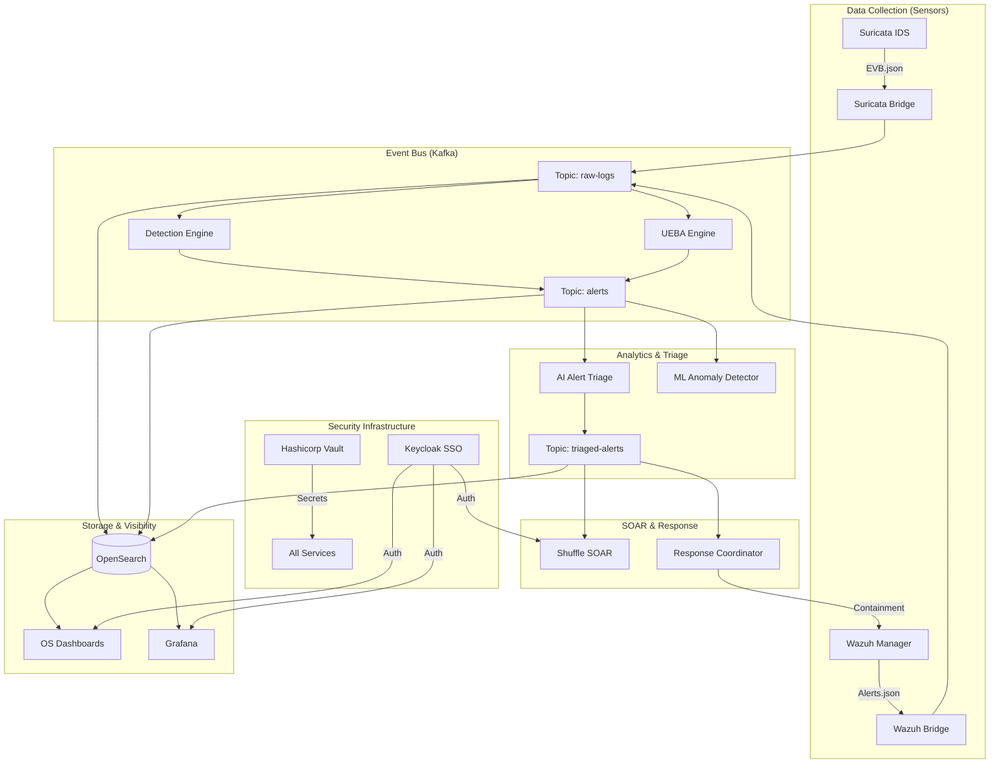

# Zero-Trust SOC Platform


A high-performance, open-source Security Operations Center (SOC) stack built on Zero-Trust principles. This platform ingests telemetry, analyzes behavior via ML/UEBA, and automates responses across network, endpoint, and identity layers.

---

## 🏗️ Architecture

The platform uses a modular, event-driven architecture centered around Kafka, ensuring high throughput and resilience.



---

## 🛠️ Service Directory

| Service | Category | Description |
| :--- | :--- | :--- |
| **Hashicorp Vault** | Security | Centralized secret management and dynamic credentialing. |
| **Keycloak** | Identity | OAuth2/OIDC identity provider for unified SSO. |
| **Kafka** | Infrastructure | Distributed event streaming for logs and alerts. |
| **OpenSearch** | Storage | Search and analytics engine for long-term data retention. |
| **Suricata** | Network | Network threat detection and intrusion prevention. |
| **Wazuh** | Endpoint | Endpoint monitoring, file integrity, and XDR. |
| **Shuffle SOAR** | Automation | Visual workflow automation for incident response. |
| **UEBA Engine** | Analytics | Graph-based (Neo4j) user and entity behavior analysis. |
| **Detection Engine** | Analytics | Flink-based stream processing for Sigma rules. |
| **AI Alert Triage** | Intelligence | Large Language Model (LLM) enrichment for high-fidelity alerts. |

---

## 🚀 Getting Started

### Prerequisites

- **Host OS**: Windows (Pro/Enterprise recommended for Docker).
- **Docker Desktop**: At least **8 GB RAM** allocated (12 GB Recommended).
- **Environment**: PowerShell 7+ and Git.

### 1. Initial Setup

Clone the repository and initialize the environment configuration:

```powershell
# Clone the repository
git clone https://github.com/your-username/Zero-Trust-SOC.git
cd Zero-Trust-SOC

# Create your production environment file (Edit with your secrets!)
cp infrastructure/docker-compose/.env.example infrastructure/docker-compose/.env.prod
```

### 2. Launch the Platform

Run the production startup script. This handles network creation, credential loading, and container orchestration:

```powershell
.\infrastructure\docker-compose\start-prod.ps1
```

### 3. Initialize Security

Once the containers are healthy, you must unseal Vault and bootstrap OpenSearch security:

1. **Unseal Vault**: Use the keys generated in `infrastructure/vault/init_keys.json`.
2. **Bootstrap OpenSearch**:
   ```powershell
   .\infrastructure\docker-compose\bootstrap-opensearch-security.ps1
   ```

---

## 🔍 Verification & Testing

Verify your pipeline is functioning correctly using the built-in smoke tests:

```powershell
# Check service health
.\scripts\smoke-test.ps1

# Generate synthetic alerts and verify detection
.\scripts\test-alerts.ps1
```

---

## 📊 Monitoring

| Tool | URL | Default Credentials |
| :--- | :--- | :--- |
| **Grafana** | `https://localhost:3000` | Vault managed / Keycloak |
| **OpenSearch Dashboards** | `http://localhost:5601` | `admin` / `OPENSEARCH_ADMIN_PASSWORD` |
| **Shuffle SOAR** | `http://localhost:3001` | Initial Setup required |
| **Vault UI** | `http://localhost:8200` | Root Token / Unseal Keys |

---

## 📜 Maintenance & Hygiene

- **Memory Optimization**: The platform is tuned to run within a **5.5 GB** memory footprint. If you encounter OOM errors (Exit Code 137), check the limits in `prod-stack.yml`.
- **Logs**: Access real-time logs via `docker compose -f infrastructure/docker-compose/prod-stack.yml logs -f`.
- **Clean Slate**: To reset the environment without losing data, use `docker compose -f infrastructure/docker-compose/prod-stack.yml down` then restart.

---

## ⚖️ License

Distributed under the MIT License. See `LICENSE` for more information.
